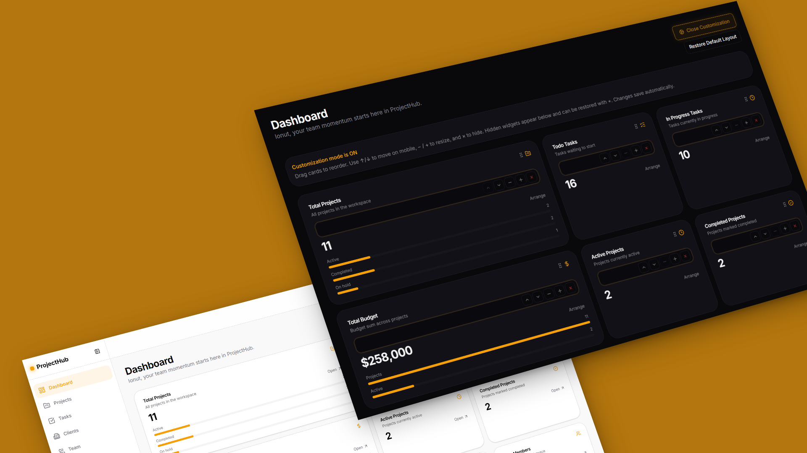
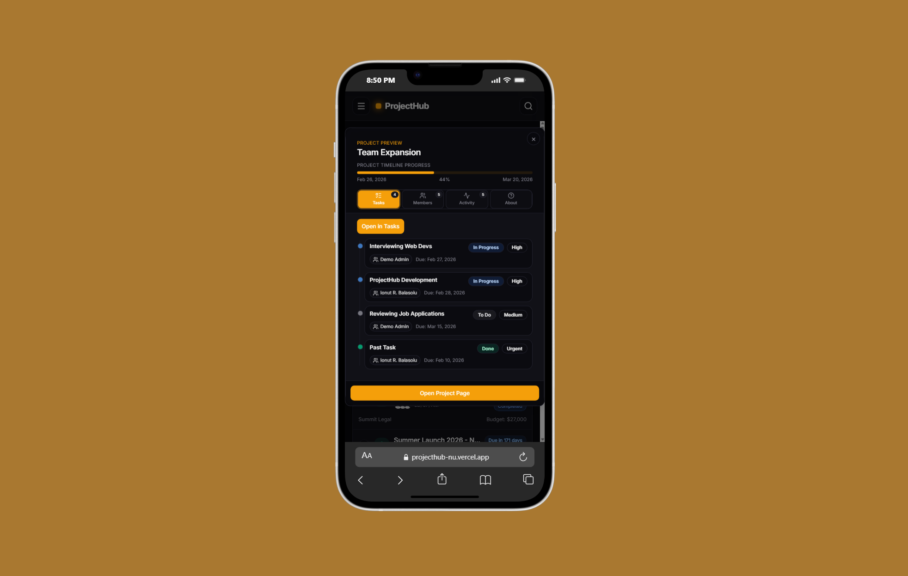
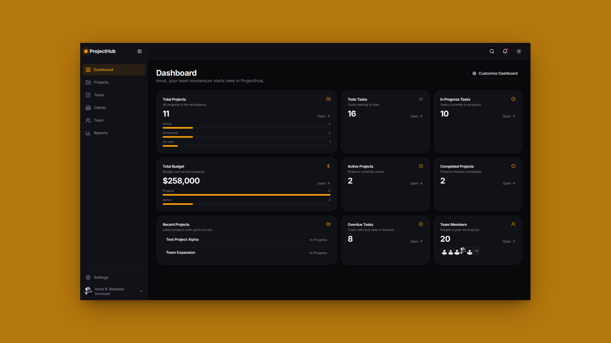
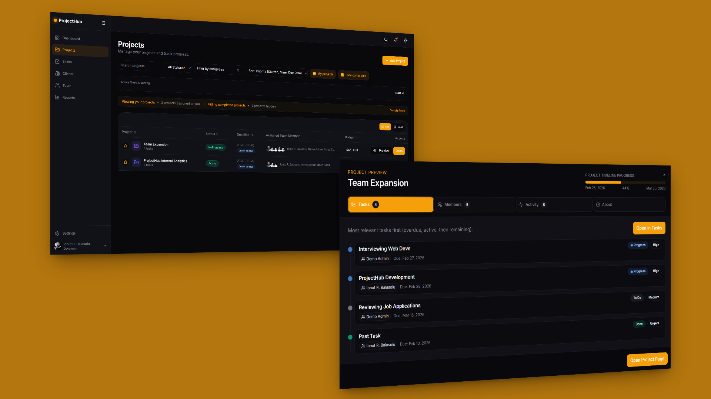
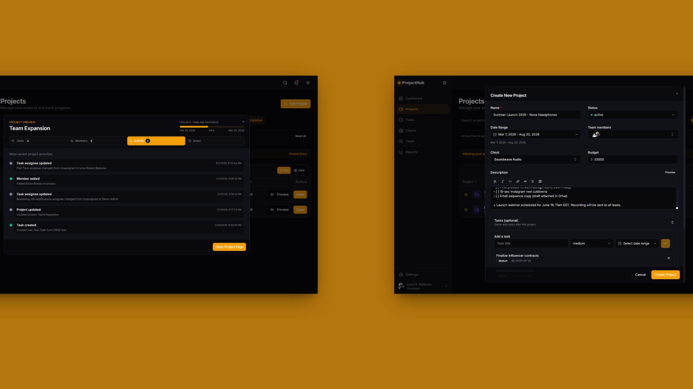
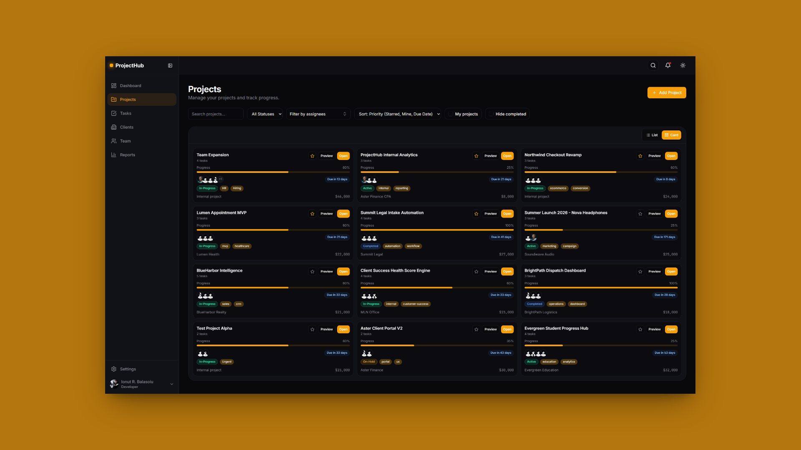
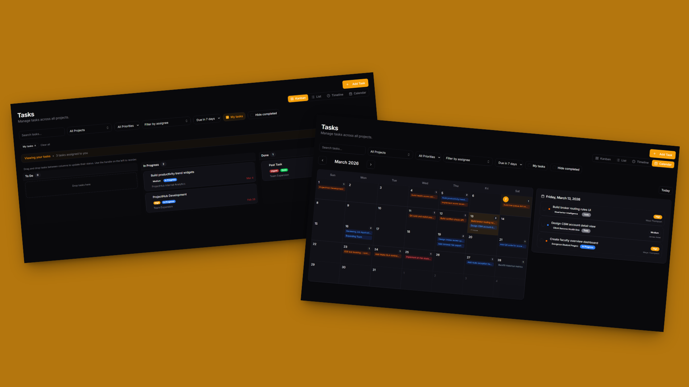
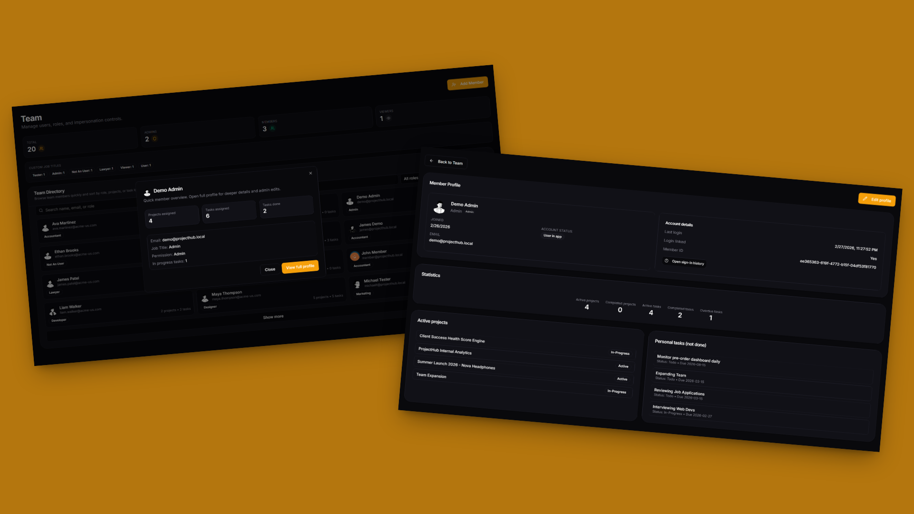
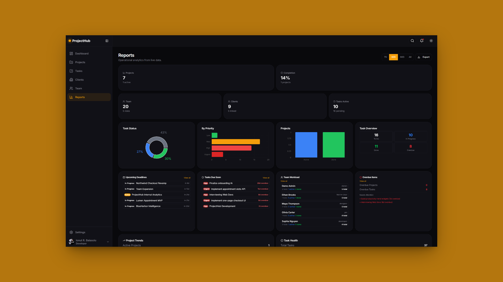
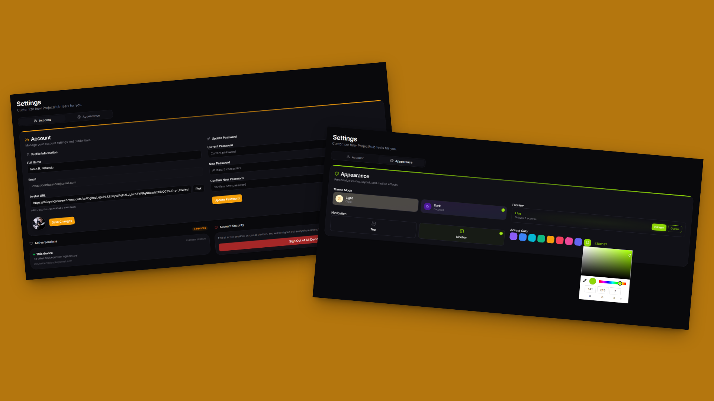

# ProjectHub

ProjectHub is a small SaaS-style project dashboard built with Next.js and Supabase.

ProjectHub keeps project work clear and practical: who owns what, what's due, what's blocked, and what's moving forward.

## Visual Showcase

Here's what ProjectHub looks like in action:

### Dashboard Customization

Tailor your workspace to match how you work best. Rearrange widgets, show or hide sections, and create your perfect command center.



### Mobile Experience

Stay connected to your projects on the go. The responsive design ensures full functionality across all your devices.



<details>
<summary><b>More Screenshots</b></summary>

#### Dashboard Overview

Your centralized hub for tracking everything that matters. See active projects, upcoming deadlines, and team activity at a glance.



#### Projects Preview

Get a quick snapshot of project health with timeline views and progress indicators that keep you informed without overwhelming detail.



#### Project Activity

Track every update, comment, and milestone in one place. Stay informed about what's happening across your projects in real-time.



#### Project Cards

Browse projects visually with rich card layouts that surface key information like status, deadlines, and team assignments instantly.



#### Tasks Workspace

Manage work your way with flexible views—switch between kanban boards, detailed lists, and calendar layouts to match your workflow.



#### Team Management

Keep your team organized with role-based access control. Manage permissions and see who's working on what with detailed member profiles.



#### Reports & Analytics

Make data-driven decisions with insights into project progress, team productivity, and workload distribution across your organization.



#### Settings

Personalize your experience with theme options, profile customization, and account preferences—all in one convenient location.



</details>

## Stack

- Next.js 16 (App Router)
- Cache Components + Partial Prerendering (PPR) enabled
- React 19
- TypeScript
- Tailwind CSS
- Supabase (Postgres + Auth)

## What you can do

- Sign in/out with Supabase auth (email + OAuth)
- Access protected dashboard routes via `src/proxy.ts`
- Create, update, filter, and search projects
- Manage team members with role-aware permissions
- Manage tasks from:
  - project details page
  - dedicated `/tasks` workspace (kanban, list, calendar)
- Star projects and persist preferences
- Customize profile/theme/avatar in Settings (Account + Appearance tabs)
- Change password in Settings
- Use admin impersonation for support/admin workflows

## Main routes

- `/auth/login`
- `/` (dashboard)
- `/projects`
- `/projects/new`
- `/projects/[id]`
- `/clients`
- `/tasks`
- `/team`
- `/team/[id]`
- `/settings`
- `/reports`

## API overview

- `/api/projects` and `/api/projects/[id]`
- `/api/tasks` and `/api/tasks/[id]`
- `/api/members` and `/api/members/[id]`
- `/api/clients`
- `/api/clients/[id]`
- `/api/profile`
- `/api/profile/password`
- `/api/auth/me`
- `/api/auth/activity`
- `/api/admin/users`
- `/api/admin/impersonation`

## Setup

1. Install dependencies:

```bash
npm install
```

2. Create `.env.local` and add:

```env
NEXT_PUBLIC_SUPABASE_URL=your-supabase-url
NEXT_PUBLIC_SUPABASE_ANON_KEY=your-supabase-anon-key
```

### Database Setup

1. Create a new Supabase project.
2. Open the **SQL Editor** in the Supabase Dashboard.
3. Copy and run the contents of [supabase-schema.sql] to create all tables and RLS policies.
4. (Optional) Run [sql/seed_dummy_data.sql] to populate the database with demo projects, members, clients, and activities.
5. (Optional) Run [sql/reset_dummy_data.sql] if you want to remove the [DEMO] data later.

6. Enable OAuth (optional):

- Configure OAuth providers in Supabase Auth settings.
- Add provider-specific environment variables to `.env.local`.

6. Run locally:

```bash
npm run dev
```

7. Production check:

```bash
npm run lint
npm run build
```

## Permission model (high-level)

- `admin`: full access
- `member`: can create/update most working data
- `viewer`: read-only dashboard access

## Notes

- Project client fallback is shown as `Internal project` when no client is selected.
- Avatar fallback order is: profile avatar -> OAuth avatar -> Gravatar/Libravatar -> generated fallback.
- This repository focuses on practical CRUD and dashboard usability first, then adds UX polish.

## Scope and features

Core project management capabilities:

- Project CRUD (list, filter, search, add, edit, delete)
- Required project fields (`status`, `deadline`, `assigned team member`, `budget`)
- Responsive frontend with projects table, status filtering, and search
- Modal-based add/edit project flow
- Backend API routes with REST-style CRUD
- Zod validation on all API inputs (budget >= 0, required fields)
- PostgreSQL persistence (Supabase)
- Seed data support (`sql/seed_dummy_data.sql`)

Expanded capabilities:

- Auth + protected routes + role-based behavior
- OAuth login (Google, GitHub)
- Tasks management with dedicated workspace (`/tasks`) and kanban/list/calendar views
- Task CRUD + status/priority/due date handling + drag/drop reorder persistence
- Clients management (`/clients`) with dedicated CRUD endpoints
- Team management with member detail pages (`/team/[id]`) and profile editing
- Dashboard personalization (widget layout, visibility, quick actions)
- Rich project preview workflows (timeline view, quick edit, task deep-linking)
- Profile/theme/avatar customization in Settings (Account + Appearance tabs)
- Password change in Settings
- Admin impersonation support workflows
- Login activity history (admin-visible) with coarse location context
- Reports page with analytics charts
